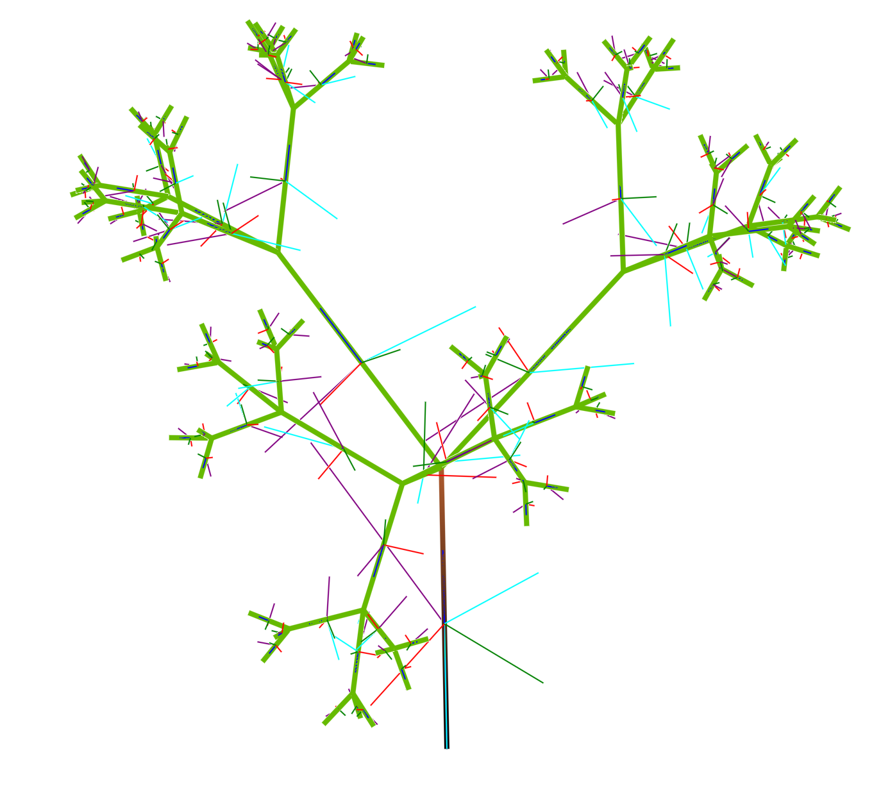

# TreeDynamics

Simulate tree-lookin structures, with spring/damper joints between each branch.

Use it to make trees that look like this:

And move around like this:

https://github.com/user-attachments/assets/e966c0e9-94e4-4721-8e38-ac2689f3b829
